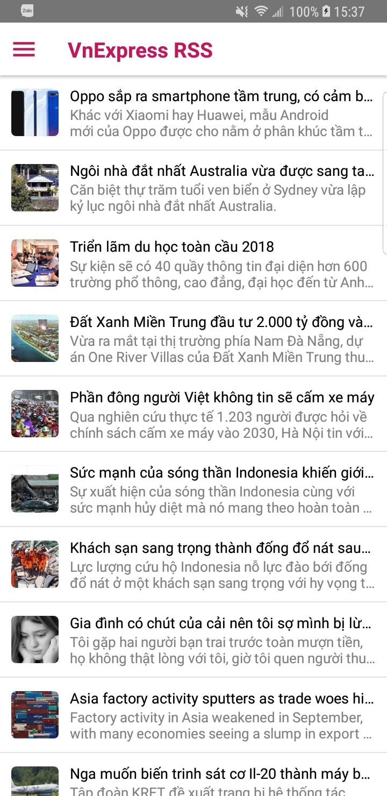
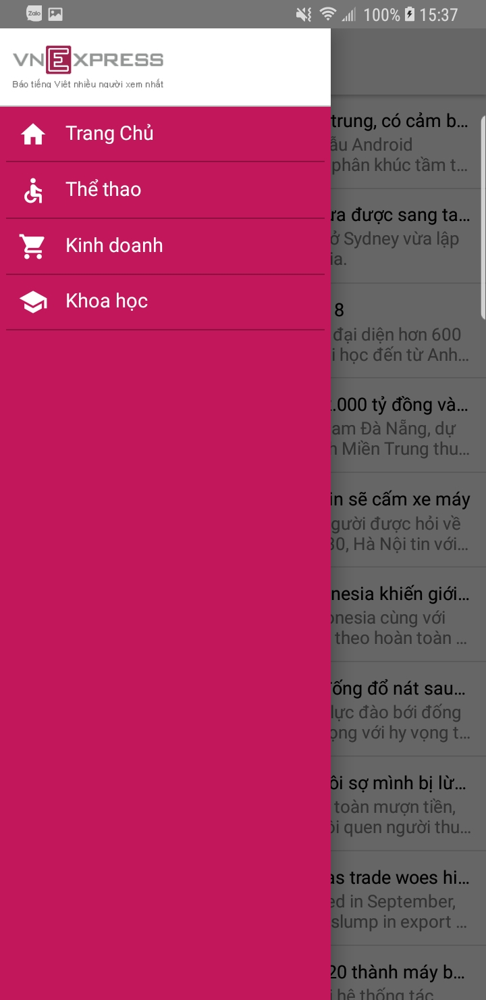
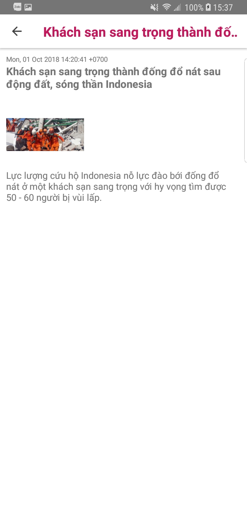

# React Native Demo

> A Simple VnExress RSS application written by react-native for iOS and Android.

## App preview

## Technical stack
- [React Native](https://facebook.github.io/react-native/)
- [React-redux](https://github.com/reduxjs/react-redux)
- [Redux](http://redux.js.org/)
- [Redux-thunk](https://github.com/reduxjs/redux-thunk)
- [react-navigation](https://reactnavigation.org/)
- [react-native-vector-icons](https://github.com/oblador/react-native-vector-icons)
- [react-native-splash-screen](https://github.com/crazycodeboy/react-native-splash-screen)
- [react-native-rss-parser](https://github.com/jameslawler/react-native-rss-parser)
- [react-native-htmlview](https://github.com/jsdf/react-native-htmlview)